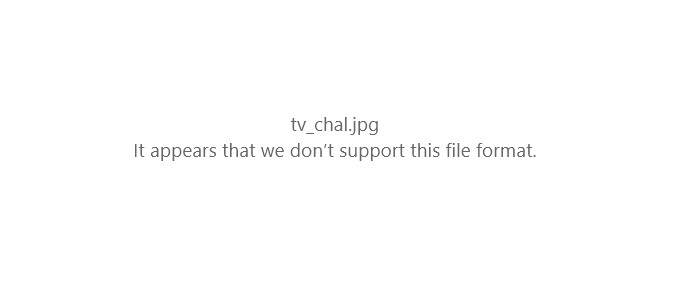
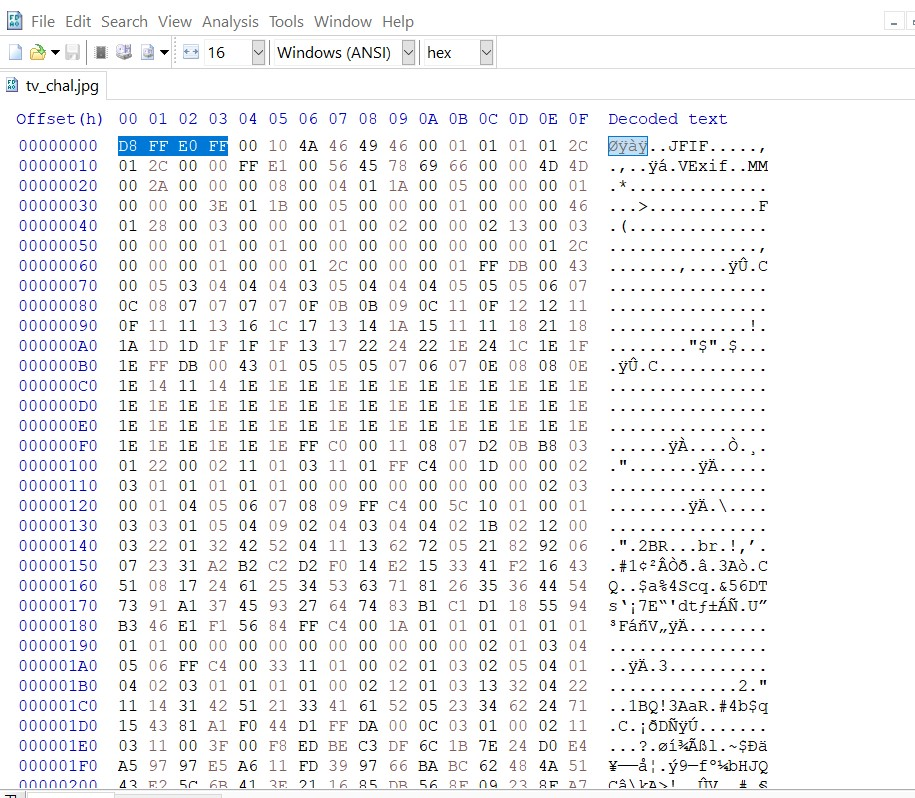
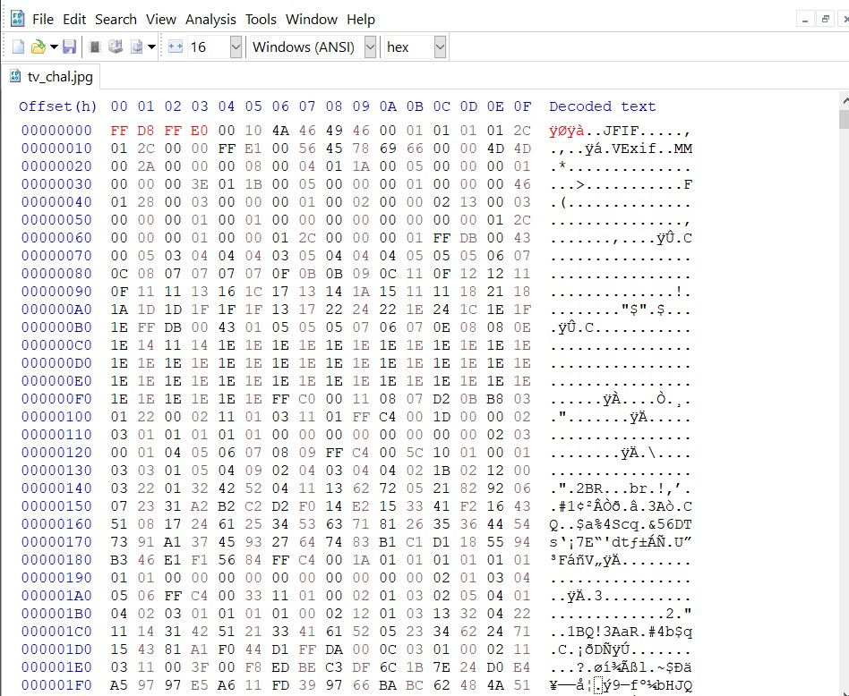
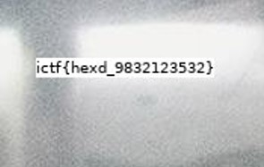

# xD

**1. When Try to open (tv_chal.jpg) file; it won't open and doesn't support file format error appeared**

**2. When i opened this image file in hex editor , my eyes directly pointed the error that first 4 hex pairs are not correctly placed**

**3. Correction of image file [Reference link](https://en.wikipedia.org/wiki/List_of_file_signatures)**

4. After editing and saving the file I got new image containg Flag but in order to view the flag i had to zoom that corrected image

